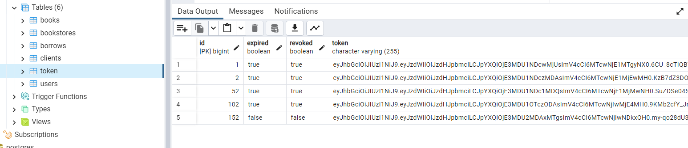
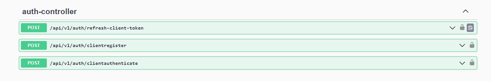
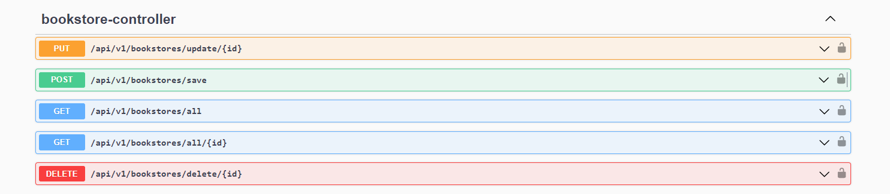
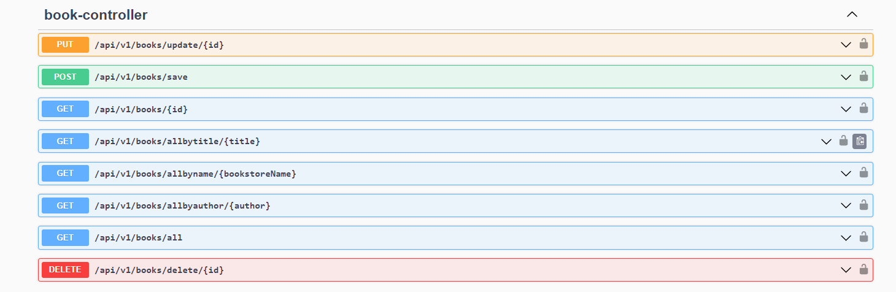
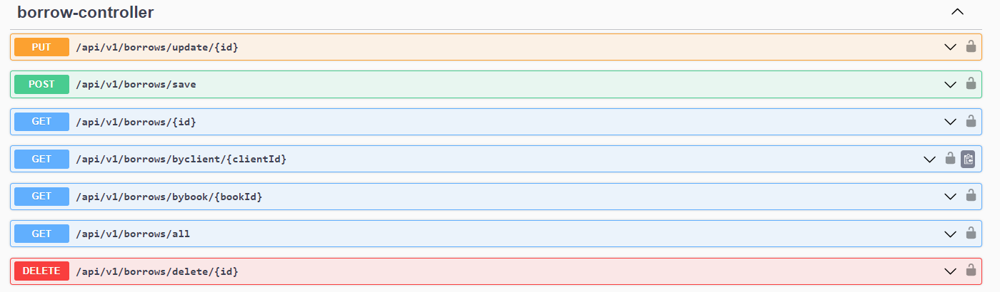
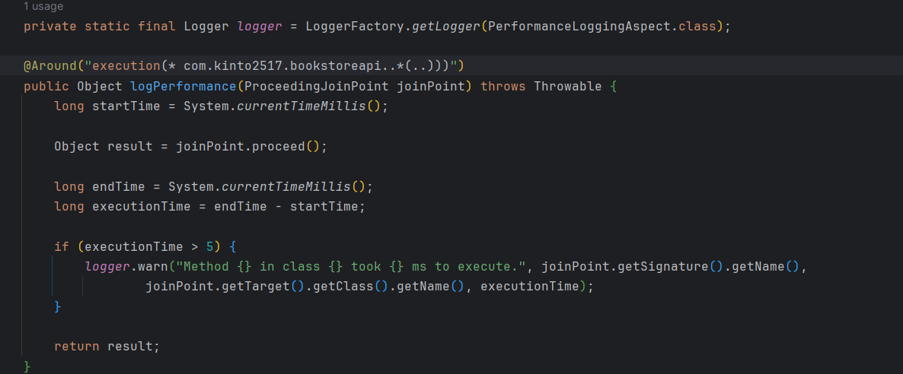

<a name="readme-top"></a>

<details>
  <summary>Table of Contents</summary>
  <ol>
    <li>
      <a href="#about-the-project">About The Project</a>
    </li>
    <li>
      <a href="#getting-started">Getting Started</a>
    </li>
    <li><a href="#built-with">Built With</a></li>
    <li><a href="#usage">Usage</a></li>
    <li><a href="#contributing">Contributing</a></li>
    <li><a href="#contact">Contact</a></li>
  </ol>
</details>


## About The Project

BookstoreAPI is a web application that manages bookstore. It allows users to create books, bookstores along with 
borrowing books that hasn't been borrowed yet. 
The project follows modern software development practices, leveraging Spring Boot for backend development, 
Spring Data JPA for data persistence, and a RESTful API for communication.

This is the API that I developed for my application for Omreon.

<p align="right">(<a href="#readme-top">back to top</a>)</p>

## Getting Started

### Prerequisites

Before you begin, make sure you have the following prerequisites:

* Docker installed on your system.
* Docker Compose installed.
* Java IDE installed.

### Installation Steps

#### Clone the Repository:

Start by cloning the BookstoreAPI repository to your local machine.

```
git clone https://github.com/Kinto2517/BookstoreAPI.git
```

#### Set Up Docker Compose File:

```diff
@@ Uygulamanın containerize edilmesi @@
```

Open a terminal in the same folder as 'Dockerfile' in the root directory where you cloned the repository.
```
FROM openjdk:17-jdk-alpine

WORKDIR /app

COPY target/BookstoreAPI-0.0.1-SNAPSHOT.jar /app/app.jar

EXPOSE 80801

CMD ["java", "-jar", "app.jar"]

```
Build the dockerfile with this command:
```
docker build -t BookstoreAPI:latest .
```
Then start the project via 
```
docker run -p 8081:8081 BookstoreAPI:latest
```


#### Starting The Project

Start the project with your favorite IDE with Docker running.

<p align="right">(<a href="#readme-top">back to top</a>)</p>

## Built With

* 
* 
* 
  
<p align="right">(<a href="#readme-top">back to top</a>)</p>


## Usage

### Database (PostgreSQL Database)



* As seen here project uses PostgreSQL 16 database for its simple database connection.


### User Controller



* As seen above this API provides simple calls to save the client and provide access_token for JWT Authentication.


### Bookstore Controller


  
* We can save a new bookstore with this API call. It will also check if the bookstore is already in the database.
* We can also get all the bookstores in the database with this API call.
* We can also get a bookstore by its id with this API call.
* It is a CRUD API call for Bookstore entity.


#### Book Controller



* We can save a new book with this API call. It will also check if the book is already in the database.
* We can also get all the books in the database with this API call.
* We can also get a book by its id, title and author with this API call.
* It is a CRUD API call for Book entity.

### Borrow Controller



* We can borrow a book with this API call. It will also check if the book is already borrowed or not.
* We can also get all the borrows in the database with this API call.
* We can also get a borrow by its id with this API call.
* It is a CRUD API call for Borrow entity.

### Unit Tests

* This project also provides unit tests for controllers and services for Bookstore, Book and User entities.

### Performance Logging



* As seen above this code provides a calcutation for all the methods in the project and 
* it logs every methods calls that extends the 5 ms time limit.

<p align="right">(<a href="#readme-top">back to top</a>)</p>


## Contact

* Ersin Yılmaz ASLAN - [My LinkedIn](https://tr.linkedin.com/in/ersinya)
* Project Link: [Bookstore API](https://github.com/Kinto2517/BookstoreAPI)

<p align="right">(<a href="#readme-top">back to top</a>)</p>